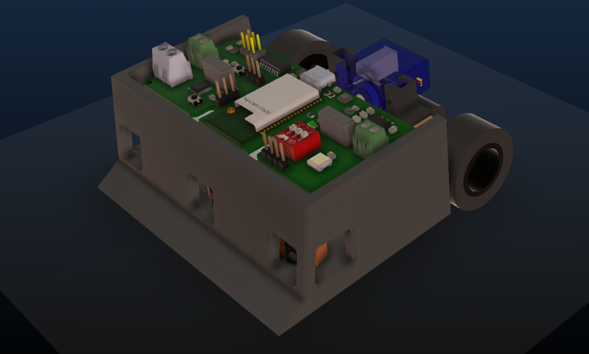
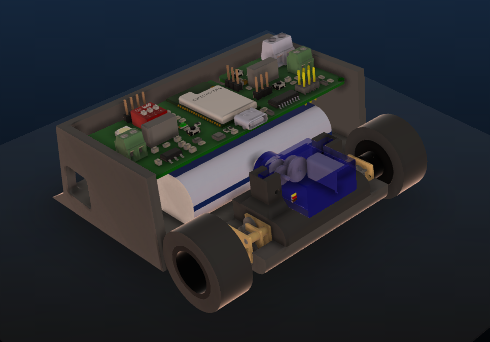
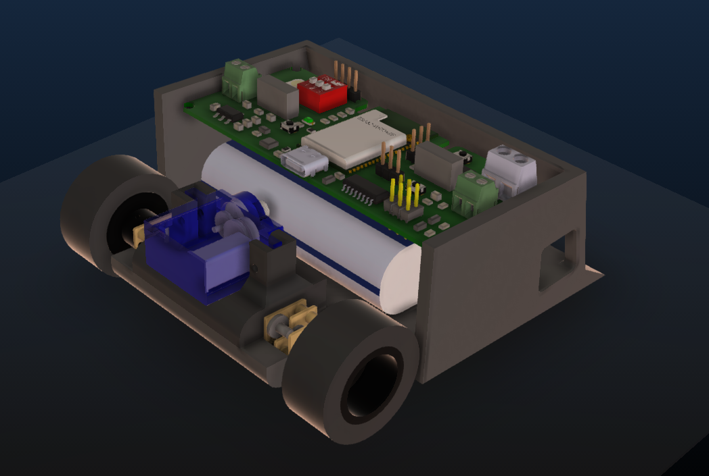
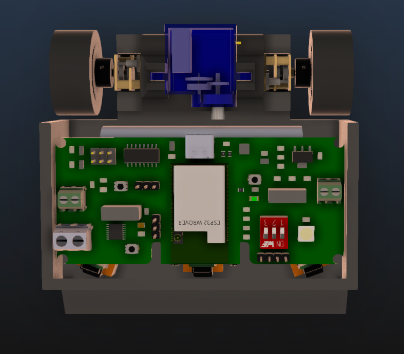
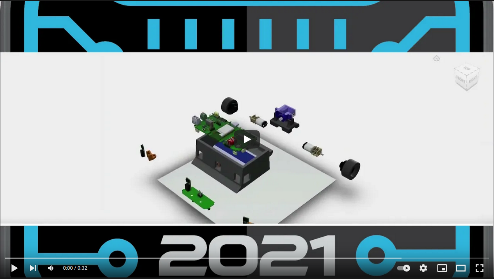

|              |   |
:-------------------------:|:-------------------------:
  |  
  |  

# Instalación Tarjeta GEC

Para la instalación en Arduino IDE debemos seguir los siguientes pasos:

1. Abrir ARDUINO IDE
2. Debemos ir a la pestaña ***Archivo***->***Preferencias***.
	- En la pestaña ***Ajustes*** buscamos la opción: ***Gestor de URLs Adicionales de Tarjetas: ***
	- Pegamos la siguiente URL: `https://dl.espressif.com/dl/package_esp32_index.json`
	- Luego presionamos la opción ***OK*** y automáticamente se cerrará la ventana.
3. Debemos ir a la pestaña ***Herramientas***->***Placa***->***Gestor de tarjetas***.
	- Colocamos en la barra de búsqueda ***ESP32***.
	- Seleccionamos la opción que nos muestre ***NodeMCU-32S***.
	- Instalamos y luego presionamos la opción de ***Cerrar***.

Con esto tendremos completa la instalación de nuestra tarjeta ESP32 y lista para ser programada.	 

# Instalación USB Driver ***(Si no reconoce el puerto COM)***

En algunos casos nuestra PC no es capaz de reconocer el dispositivo USB que nosotros conectamos, es por ello que dejaremos un archivo para la instalación del driver con ello nuestra PC deberá ser capaz de reconocer el dispositivo conectado, en caso de que el problema persista asegúrese de que su dispositivo no se este sobre calentando.

[Descarga este driver para Windows][DRIVER_USB]

[DRIVER_USB]: https://www.arduined.eu/files/windows10/CH341SER.zip

1. Descomprimir el archivo ZIP descargado 
2. Seleccionar el archivo para instalación de Windows
	- SETUP.exe
3. Seleccionar CH341SER.INF
4. Click en la opción ***Install***
5. Cuando este instalado cerrar la ventana y listo.!

Con esto estaría lista la instalación del Driver USB para nuestra tarjeta en el Sistema Operativo Windows.

Puede seguir está guía para la instalación como una segunda opción 

[Sigue la guía para instalar el driver CH340][DRIVER_CH340]

[DRIVER_CH340]: https://www.arduined.eu/ch340-windows-10-driver-download/

## Pinout

### Motores
Nombre | GPIO 
--- | --- 
AIN1 | 13
AIN2 | 15
BIN1 | 2
BIN2 | 4

### Sensores Sharp
Nombre | GPIO 
--- | --- 
J1 | 33
J2 | 25
J3 | 26

### Sensores QRE1113
Nombre | GPIO 
--- | --- 
QRE1 | 36
QRE2 | 39
QRE3 | 34

### DIP Switch
Nombre | GPIO 
--- | --- 
MODO 1 | 27
MODO 2 | 14
MODO 3 | Siempre ON

### Otras funciones
Nombre | GPIO 
--- | --- 
NeoPixel | 32
Start | 35
Servo | 5

# Licencia

Hardware License: CERN OHL v1.0 para más información visitar el siguiente [Link][CERN_v1].

[CERN_v1]: https://ohwr.org/project/cernohl/wikis/Documents/CERN-OHL-version-1.2

Software License: GPL v3

Documentation License: CC BY 4.0 International
